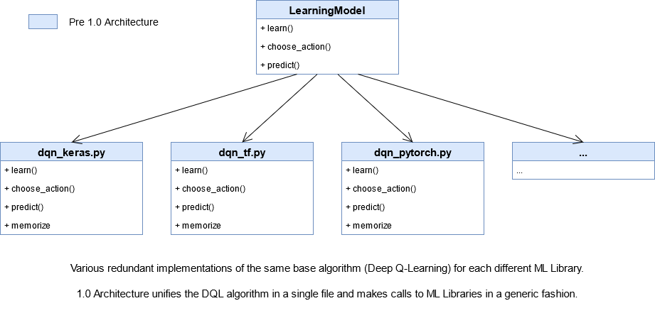
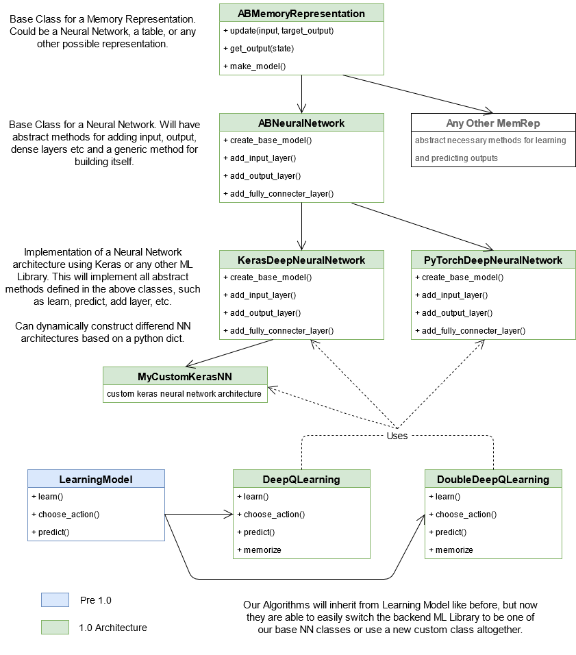

# Models

Models are a generalized AI term used to reference both Neural Networks and the Machine Learning
Algorithms used to train them. It is inside a Model where we define methods that allow a Neural
Network to construct its own architecture using a Machine Learning Library, to learn using
information from the environment and its reward function and to select an optimal action for a
certain situation.

Models are often implemented with the Algorith and the Neural Network being intertwined together in
one file, and that is how URNAI used to implement Models up until version 1.0. These legacy URNAI
Models can be seen in this directory, on files such as [ddqn_keras.py](./ddqn_keras.py)
or [dqn_keras.py](./dqn_keras.py), and are fairly straightforward for anyone that has implemented a
Reinforcement Learning Algorithm before.

From version 1.0 onwards URNAI supports the separation of Neural Networks and ML Algorithms, so you
can create a Deep Q-Learning Algorithm, for example, and couple it with any Neural Network
architecture you desire. Due to this separation, the same Algorithm can be used with different ML
libraries as a back end, enabling you to run experiments with the exact same algorithm in Keras and
then on PyTorch by simply changing a parameter, without having to manually change the Library calls
throughout the entire code, as those are handled generically by URNAI.

Our Neural Network classes are stored
on [memory_representations/neural_network](./memory_representations/neural_network). To understand
our naming convention of what is a memory representation, and to understand our base Neural Network
classes we recommend you read the description of
our [ABMemoryRepresentation](./memory_representations/base/abmem.py)
, [ABNeuralNetwork](./memory_representations/neural_network/abneuralnetwork.py)
and [KerasDeepNeuralNetwork](./memory_representations/neural_network/keras.py) classes in their
python files.

The Machine Learning Algorithms implemented by default in URNAI are stored
on [algorithms](./algorithms), and their usage is exactly the same of any model from before 1.0
version, making both ways of creating models compatible.

The following images compare pre 1.0 and 1.0 architecture, making it a bit easier to visualize the
changes, and how the 1.0 architecture facilitates modularity and flexibility for model creation.

## Pre 1.0

## 1.0

The 1.0 URNAI architecture was created with the goal of allowing both advanced machine learning
researchers and newcomers to the field the ability of quickly creating and testing their desired
model architectures.

If you're a newcomer, or if you just want to get the hang of URNAI without going too deep into model
building, you can start by using an algorithm directly (DeepQLearning, DoubleDeepQLearning, etc). To
do that, you simply have to use the [ModelBuilder class](model_builder.py) to dynamically construct
a NN architecture and pass that to your algorithm. Examples of this can be seen on our solve files,
but basically you instantiate a ModelBuilder object, add layers (input, dense, output) and then pass
the python dict of the ModelBuilder object to your algorithm through the "build_model" atribute. In
this way, you can easily specify the size of your input, fully connected and output layers, without
having to worry about implementation details.

If you have more knowledge on AI and Reinforcement Learning, you might want to start your model
building by creating a new class that inherits from either KerasDeepNeuralNetwork or
PyTorchDeepNeuralNetwork. You can find an example of how to do that in
our [DNNCustomModelOverrideExample class](./memory_representations/neural_network/keras.py). If you
want even more flexibility, and less overhead from our base Keras/PyTorch classes, you can inherit
directly from [ABNeuralNetwork](./memory_representations/neural_network/abneuralnetwork.py) or
even [ABMemoryRepresentation](./memory_representations/base/abmem.py), just make sure to implement
all necessary abstract methods, so that your custom class fits over URNAI's architecture, making it
usable by the training module.

## Adding a new Model

Adding new Models is fairly simple:

### Old Way

If you want to do it with pre 1.0 architecture, just create a new class that inherits
from [LearningModel](./base/abmodel.py) and code in there both your algorithm and the neural network
and its calls to your prefered Machine Learning Library. You will need to implement all necessary
methods, such as learn, predict, save_extra, etc. An example of a pre 1.0 implementation can be seen
in our [dqn_keras.py file](./dqn_keras.py).

### New Way

If you want to use the new architecture, you have a couple of different options:

#### Adding a new Algorithm

If you're trying to implement a new RL algorithm (A3C, DDPG, or any other) you just need to create a
new class that inherits from [LearningModel](./base/abmodel.py), implement your algorithm in there,
and whenever you want to make the NN learn, predict etc you can just use generic calls to the Neural
Network's class, allowing you to use any Model architecture or ML Library you desire as a back end
to this new algorithm. Examples on how to do this can be seen in
our [DeepQLearning algorithm](./algorithms/dql.py) or
our [DoubleDeepQLearning algorithm](./algorithms/ddql.py).

#### Adding a new Memory Representation

If you're interested in creating a new Neural Network architecture you can do that by inheriting
from either KerasDeepNeuralNetwork or PyTorchDeepNeuralNetwork and then build a custom "
make_model( )" method, such as
in [DNNCustomModelOverrideExample](./memory_representations/neural_network/keras.py).

If you want to add support for a new ML Library other than Keras or PyTorch, you can inherit
from [ABNeuralNetwork](./memory_representations/neural_network/abneuralnetwork.py) and add your
library-specific calls in your new class.

If you want to experiment with a new type of memory representation, you can inherit
from [ABMemoryRepresentation](./memory_representations/base/abmem.py), and implement how your MemRep
will learn, predict actions and create its architecture.
